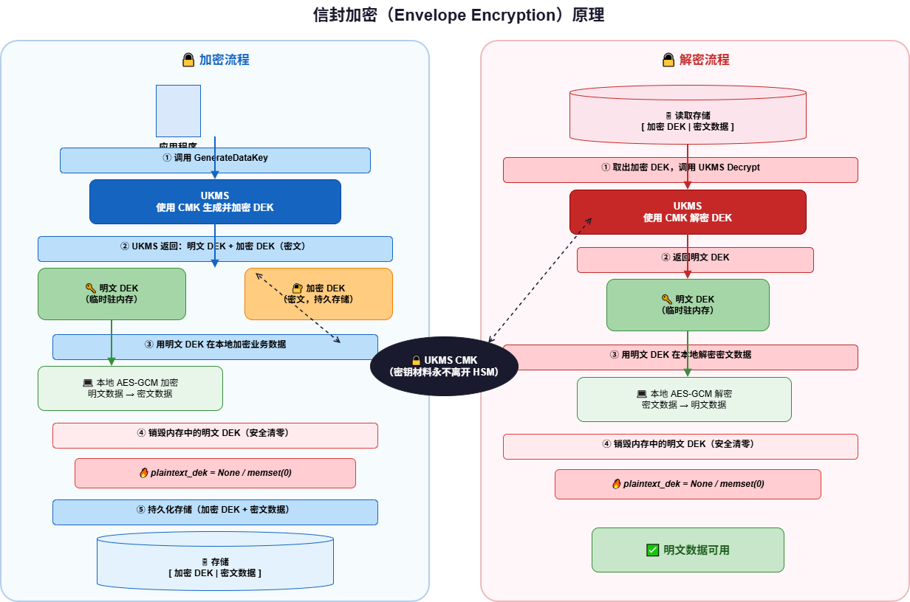

# 数据密钥

数据密钥（Data Encryption Key，DEK）是用于在本地加密大量数据的密钥。UKMS 提供生成数据密钥的能力，帮助您实现信封加密模式。

## 信封加密原理



信封加密是一种两层加密架构：
- **外层**：使用 UKMS CMK 加密数据密钥
- **内层**：使用数据密钥在本地加密实际业务数据

这种模式的优点：
1. 大量数据在本地加密，无需通过网络传输到 KMS
2. CMK 只用于保护数据密钥，密钥材料不离开 HSM
3. 更换 CMK 时只需重新加密数据密钥，而不需要重新加密所有数据

## 生成数据密钥（GenerateDataKey）

生成一个数据密钥，同时返回**明文数据密钥**和**加密后的数据密钥**。

**请求参数**

| 参数 | 类型 | 必填 | 说明 |
|------|------|------|------|
| ResourceId | string | 是 | UKMS 实例 ID |
| KeyId | string | 是 | 用于保护数据密钥的 CMK ID（须为对称密钥） |
| KeySpec | string | 条件 | 数据密钥规格：`AES_128` 或 `AES_256` |
| NumberOfBytes | int | 条件 | 自定义数据密钥字节数（与 KeySpec 二选一） |
| EncryptionContext | object | 否 | 加密上下文（解密时须提供相同上下文） |

**请求示例**

```json
POST /ukms/generate_data_key

{
  "Action": "GenerateDataKey",
  "Region": "cn-bj2",
  "ResourceId": "ukms-xxxxxxxx",
  "KeyId": "fd601a9a-c0c9-4dfb-a7ff-e5fd9f484ddc",
  "KeySpec": "AES_256",
  "EncryptionContext": {
    "purpose": "file-encryption",
    "fileId": "doc-001"
  }
}
```

**响应示例**

```json
{
  "RetCode": 0,
  "Plaintext": "AkjB8f...",
  "CiphertextBlob": "AQICAHg5z...",
  "KeyId": "fd601a9a-c0c9-4dfb-a7ff-e5fd9f484ddc"
}
```

| 响应字段 | 说明 |
|----------|------|
| Plaintext | Base64 编码的明文数据密钥（使用后立即从内存销毁） |
| CiphertextBlob | Base64 编码的加密数据密钥（与业务密文一起持久化存储） |
| KeyId | 保护数据密钥的 CMK ID |

## 生成仅密文数据密钥（GenerateDataKeyWithoutPlaintext）

只返回加密后的数据密钥，不返回明文。适用于不需要立即使用数据密钥的场景（例如生成密钥后发送给其他方解密使用）。

```json
POST /ukms/generate_data_key_without_plaintext

{
  "Action": "GenerateDataKeyWithoutPlaintext",
  "Region": "cn-bj2",
  "ResourceId": "ukms-xxxxxxxx",
  "KeyId": "fd601a9a-c0c9-4dfb-a7ff-e5fd9f484ddc",
  "KeySpec": "AES_256"
}
```

**响应示例**

```json
{
  "RetCode": 0,
  "CiphertextBlob": "AQICAHg5z...",
  "KeyId": "fd601a9a-c0c9-4dfb-a7ff-e5fd9f484ddc"
}
```

## 生成数据密钥对（GenerateDataKeyPair）

生成一对非对称数据密钥（公钥+私钥），私钥由指定的 CMK 保护。

```json
POST /ukms/generate_data_key_pair

{
  "Action": "GenerateDataKeyPair",
  "Region": "cn-bj2",
  "ResourceId": "ukms-xxxxxxxx",
  "KeyId": "fd601a9a-c0c9-4dfb-a7ff-e5fd9f484ddc",
  "KeyPairSpec": "RSA_2048"
}
```

**响应字段**

| 字段 | 说明 |
|------|------|
| PrivateKeyPlaintext | 明文私钥（Base64 编码） |
| PrivateKeyCiphertextBlob | 加密私钥（Base64 编码） |
| DataPublicKey | 公钥（明文） |
| KeyId | 保护私钥的 CMK ID |
| KeyPairSpec | 密钥对规格 |

## 生成随机数（GenerateRandom）

生成密码学安全的随机字节序列。

```json
POST /ukms/generate_random

{
  "Action": "GenerateRandom",
  "Region": "cn-bj2",
  "NumberOfBytes": 32
}
```

- `NumberOfBytes` 范围：1–1024 字节
- 返回 Base64 编码的随机字节

## 信封加密完整示例

### 加密流程

```python
# 1. 生成数据密钥
response = ukms.generate_data_key(
    ResourceId="ukms-xxxxxxxx",
    KeyId="fd601a9a-c0c9-4dfb-a7ff-e5fd9f484ddc",
    KeySpec="AES_256",
    EncryptionContext={"fileId": "doc-001"}
)
plaintext_dek = base64.decode(response.Plaintext)    # 明文数据密钥
encrypted_dek = response.CiphertextBlob              # 加密数据密钥

# 2. 使用明文 DEK 在本地加密数据
cipher = AES_256_GCM(key=plaintext_dek)
ciphertext_data = cipher.encrypt(plaintext_data)

# 3. 销毁内存中的明文 DEK（安全清零）
plaintext_dek = None

# 4. 存储：加密数据密钥 + 密文数据
store(encrypted_dek, ciphertext_data)
```

### 解密流程

```python
# 1. 读取存储的加密数据密钥和密文数据
encrypted_dek, ciphertext_data = load()

# 2. 调用 UKMS 解密数据密钥
response = ukms.decrypt(
    ResourceId="ukms-xxxxxxxx",
    CiphertextBlob=encrypted_dek,
    EncryptionContext={"fileId": "doc-001"}
)
plaintext_dek = base64.decode(response.Plaintext)

# 3. 使用明文 DEK 在本地解密数据
cipher = AES_256_GCM(key=plaintext_dek)
plaintext_data = cipher.decrypt(ciphertext_data)

# 4. 销毁内存中的明文 DEK
plaintext_dek = None
```

## 最佳实践

1. **及时销毁明文数据密钥**：使用完明文数据密钥后立即从内存中清除
2. **同一份数据使用一个数据密钥**：不同文件/记录应使用不同的数据密钥
3. **加密上下文绑定业务语义**：用 EncryptionContext 绑定文件 ID、用户 ID 等，防止密钥被挪用
4. **分开存储**：加密数据密钥和密文数据可以存储在不同位置，增加安全性
