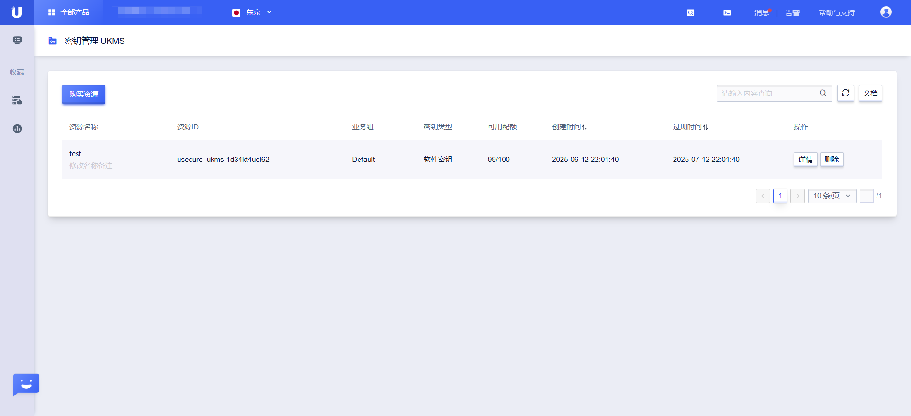
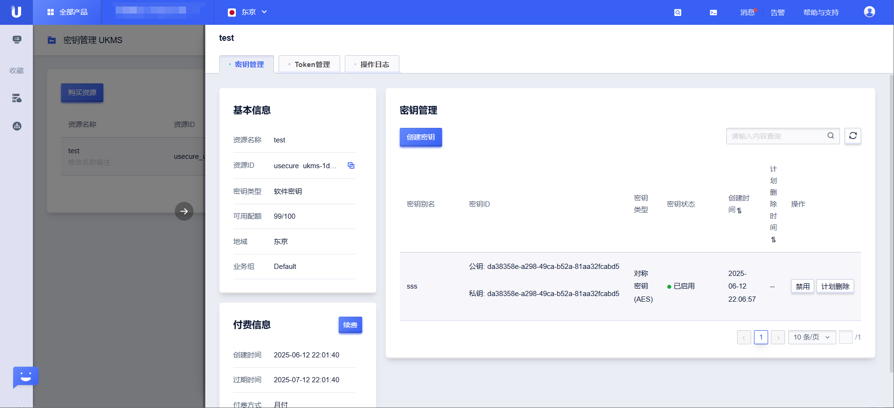

# 实例管理

UKMS 实例是您使用密钥管理服务的基础单位，提供独立的密钥管理空间和配额。

## 创建实例

通过 `CreateUKmsInstance` 接口购买并创建 UKMS 实例。

**请求参数**

| 参数 | 类型 | 必填 | 说明 |
|------|------|------|------|
| ChargeType | string | 是 | 计费类型：`Month`（按月）或 `Year`（按年） |
| Quantity | int | 是 | 购买数量（月数或年数） |
| KeyQuota | int | 是 | 密钥配额，范围 100–999,999,990，须为 10 的倍数 |
| Name | string | 否 | 实例名称 |
| Tag | string | 否 | 业务组标签 |
| Type | string | 是 | 实例类型：`software` 或 `hardware` |

**请求示例**

```json
POST /ukms/create_u_kms_instance

{
  "Action": "CreateUKmsInstance",
  "Region": "cn-bj2",
  "ChargeType": "Month",
  "Quantity": 1,
  "KeyQuota": 1000,
  "Name": "生产环境密钥管理",
  "Type": "software"
}
```

**响应示例**

```json
{
  "RetCode": 0,
  "ResourceId": "ukms-xxxxxxxx"
}
```

> **注意**：创建实例前可调用 `DescribeUKmsInstancePrice` 查询预估费用。

## 查询实例列表

通过 `ListUKmsInstance` 接口分页查询当前账户下的所有 UKMS 实例。

**请求示例**

```json
POST /ukms/list_u_kms_instance

{
  "Action": "ListUKmsInstance",
  "Region": "cn-bj2",
  "Offset": 0,
  "Limit": 10
}
```

**响应字段说明**

| 字段 | 说明 |
|------|------|
| ResourceId | 实例唯一标识符 |
| Name | 实例名称 |
| Type | 实例类型（software/hardware） |
| ChargeType | 计费类型 |
| KeyQuota | 密钥配额上限 |
| RemainKeyQuota | 剩余可用配额 |
| ExpiryTime | 实例到期时间（Unix 时间戳） |
| CreateTime | 实例创建时间（Unix 时间戳） |



## 查询实例价格

在购买实例前，通过 `DescribeUKmsInstancePrice` 查询预估费用：

```json
POST /ukms/describe_u_kms_instance_price

{
  "Action": "DescribeUKmsInstancePrice",
  "Region": "cn-bj2",
  "ChargeType": "Month",
  "Quantity": 1,
  "KeyQuota": 1000,
  "Type": "software"
}
```

## 升级实例配额

当密钥配额不足时，通过 `UpgradeUKmsInstance` 增加密钥配额：

**请求示例**

```json
POST /ukms/upgrade_u_kms_instance

{
  "Action": "UpgradeUKmsInstance",
  "Region": "cn-bj2",
  "ResourceId": "ukms-xxxxxxxx",
  "KeyQuota": 5000
}
```

> **说明**：升级只能增加配额，不能减少。升级前可通过 `DescribeUKmsUpgradePriceInfo` 查询升级费用。

## 删除实例

通过 `DeleteUKmsInstance` 删除 UKMS 实例。

> **警告**：删除实例将永久销毁实例内的所有密钥。被这些密钥保护的数据（如数据密钥密文）将无法恢复。请在确认不再需要该实例时才执行此操作。

**删除前注意事项**
1. 确认实例内的所有密钥已不再被使用
2. 确认已备份所有需要的数据或已迁移到其他实例
3. 注意删除操作不可撤销

**请求示例**

```json
POST /ukms/delete_u_kms_instance

{
  "Action": "DeleteUKmsInstance",
  "Region": "cn-bj2",
  "ResourceId": "ukms-xxxxxxxx"
}
```

## 为实例创建访问令牌

UKMS 实例通过 JWT 令牌进行访问控制。请参阅[访问令牌管理](token-management.md)了解详情。


