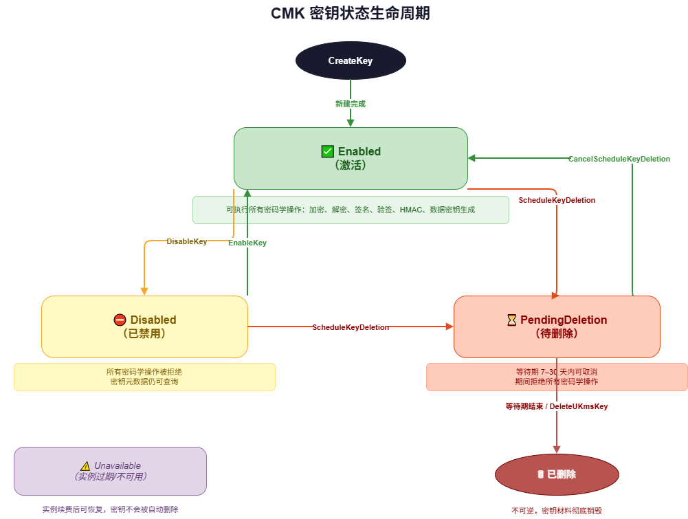
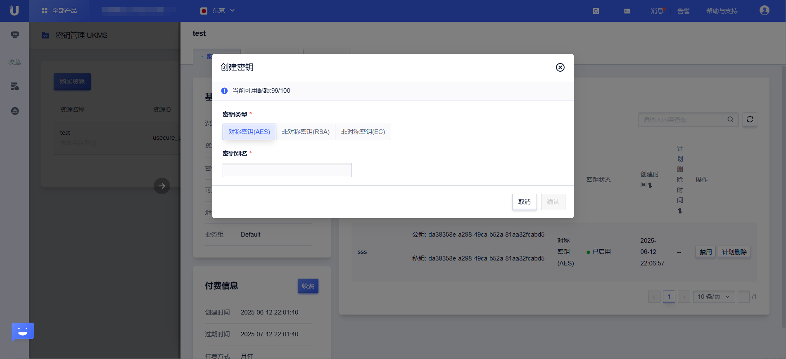

# 密钥管理

本文介绍 UKMS 密钥的完整生命周期管理，包括创建、查询、禁用、删除等操作。

## 密钥生命周期



密钥从创建到删除经历以下状态：

```
创建 → Enabled（启用）→ Disabled（禁用）→ PendingDeletion（待删除）→ 永久删除
```

- **Enabled**：密钥激活，可用于所有加密操作
- **Disabled**：密钥被禁用，加密操作将被拒绝，但可重新启用
- **PendingDeletion**：设置了计划删除时间，在时间到达前可取消

## 创建密钥

通过 `CreateKey` 接口创建新的 CMK。

**请求参数**

| 参数 | 类型 | 必填 | 说明 |
|------|------|------|------|
| ResourceId | string | 是 | UKMS 实例 ID |
| KeySpec | string | 否 | 密钥规格，默认 `SYMMETRIC_DEFAULT` |
| Description | string | 否 | 密钥描述，最长 8192 字符 |
| Origin | string | 否 | 密钥来源，默认 `UCLOUD_KMS` |
| DeletionProtection | bool | 否 | 是否开启删除保护，默认 false |
| Alias | string | 否 | 密钥别名，格式 `alias/名称` |

**支持的 KeySpec**

| KeySpec | 类型 | 支持的操作 |
|---------|------|-----------|
| `SYMMETRIC_DEFAULT` | 对称 | 加密/解密、数据密钥 |
| `RSA_2048` | 非对称 | 加密/解密、签名/验签 |
| `RSA_3072` | 非对称 | 加密/解密、签名/验签 |
| `RSA_4096` | 非对称 | 加密/解密、签名/验签 |
| `ECC_NIST_P256` | 非对称 | 签名/验签 |
| `ECC_NIST_P384` | 非对称 | 签名/验签 |
| `ECC_NIST_P521` | 非对称 | 签名/验签 |
| `HMAC_256` | 对称 | 生成/验证 MAC |
| `HMAC_384` | 对称 | 生成/验证 MAC |
| `HMAC_512` | 对称 | 生成/验证 MAC |

**请求示例（创建对称密钥）**

```json
POST /ukms/create_key

{
  "Action": "CreateKey",
  "Region": "cn-bj2",
  "ResourceId": "ukms-xxxxxxxx",
  "KeySpec": "SYMMETRIC_DEFAULT",
  "Description": "数据库字段加密密钥",
  "DeletionProtection": true,
  "Alias": "alias/db-field-key"
}
```

**请求示例（创建 RSA 签名密钥）**

```json
POST /ukms/create_key

{
  "Action": "CreateKey",
  "Region": "cn-bj2",
  "ResourceId": "ukms-xxxxxxxx",
  "KeySpec": "RSA_2048",
  "Description": "代码签名密钥"
}
```

**响应示例**

```json
{
  "RetCode": 0,
  "KeyId": "fd601a9a-c0c9-4dfb-a7ff-e5fd9f484ddc",
  "KeyMetadata": {
    "KeyId": "fd601a9a-c0c9-4dfb-a7ff-e5fd9f484ddc",
    "KeySpec": "SYMMETRIC_DEFAULT",
    "KeyState": "Enabled",
    "KeyUsage": ["ENCRYPT_DECRYPT"],
    "Origin": "UCLOUD_KMS",
    "Description": "数据库字段加密密钥",
    "DeletionProtection": true,
    "CreationDate": 1752634800
  }
}
```



## 查询密钥列表

通过 `ListKeys` 接口分页查询实例下的所有密钥。

**请求示例**

```json
POST /ukms/list_keys

{
  "Action": "ListKeys",
  "Region": "cn-bj2",
  "ResourceId": "ukms-xxxxxxxx",
  "Offset": 0,
  "Limit": 20
}
```

支持模糊搜索（通过 `Alias` 或 `KeyId` 参数），响应中包含密钥基本信息和轮转配置。

## 查询密钥详情

通过 `DescribeKey` 接口查询单个密钥的完整元数据。

**请求示例**

```json
POST /ukms/describe_key

{
  "Action": "DescribeKey",
  "Region": "cn-bj2",
  "ResourceId": "ukms-xxxxxxxx",
  "KeyId": "fd601a9a-c0c9-4dfb-a7ff-e5fd9f484ddc"
}
```

**KeyId 支持两种格式**：
- 实际 KeyId：`fd601a9a-c0c9-4dfb-a7ff-e5fd9f484ddc`
- 别名：`alias/my-key`

**响应字段（KeyMetadata）**

| 字段 | 说明 |
|------|------|
| KeyId | 密钥唯一标识符 |
| KeySpec | 密钥规格 |
| KeyState | 密钥状态（Enabled/Disabled/PendingDeletion） |
| KeyUsage | 密钥用途列表 |
| Origin | 密钥来源 |
| Description | 密钥描述 |
| DeletionProtection | 是否开启删除保护 |
| DeletionDate | 计划删除时间（Unix 时间戳，未设置时为 0） |
| CreationDate | 创建时间（Unix 时间戳） |
| KeyVersion | 密钥版本号（轮转后递增） |
| KeyRotationEnabled | 是否开启自动轮转 |
| RotationPeriodInDays | 自动轮转周期（天） |

## 更新密钥描述

通过 `UpdateKeyDescription` 接口修改密钥描述信息。

```json
POST /ukms/update_key_description

{
  "Action": "UpdateKeyDescription",
  "Region": "cn-bj2",
  "ResourceId": "ukms-xxxxxxxx",
  "KeyId": "fd601a9a-c0c9-4dfb-a7ff-e5fd9f484ddc",
  "Description": "更新后的描述，最长 8192 字符"
}
```

## 禁用密钥

通过 `DisableKey` 接口禁用密钥。禁用后的密钥不能用于加密操作。

```json
POST /ukms/disable_key

{
  "Action": "DisableKey",
  "Region": "cn-bj2",
  "ResourceId": "ukms-xxxxxxxx",
  "KeyId": "fd601a9a-c0c9-4dfb-a7ff-e5fd9f484ddc"
}
```

**注意**：处于 `PendingDeletion` 状态的密钥无法被禁用。

## 启用密钥

通过 `EnableKey` 接口重新启用已禁用的密钥。

```json
POST /ukms/enable_key

{
  "Action": "EnableKey",
  "Region": "cn-bj2",
  "ResourceId": "ukms-xxxxxxxx",
  "KeyId": "fd601a9a-c0c9-4dfb-a7ff-e5fd9f484ddc"
}
```

## 设置删除保护

通过 `SetDeletionProtection` 接口开启或关闭密钥的删除保护。

```json
POST /ukms/set_deletion_protection

{
  "Action": "SetDeletionProtection",
  "Region": "cn-bj2",
  "ResourceId": "ukms-xxxxxxxx",
  "KeyId": "fd601a9a-c0c9-4dfb-a7ff-e5fd9f484ddc",
  "DeletionProtection": true
}
```

**最佳实践**：对于重要的生产环境密钥，建议开启删除保护，防止误操作。

## 计划删除密钥

密钥删除是一个两步操作，需先设置计划删除时间，到达时间后密钥才会被永久删除。

### 第一步：设置计划删除时间

通过 `ScheduleKeyDeletion` 接口设置密钥的计划删除时间：

```json
POST /ukms/schedule_key_deletion

{
  "Action": "ScheduleKeyDeletion",
  "Region": "cn-bj2",
  "ResourceId": "ukms-xxxxxxxx",
  "KeyId": "fd601a9a-c0c9-4dfb-a7ff-e5fd9f484ddc",
  "PlanDeleteTime": 1755310800
}
```

**约束条件**：
- `PlanDeleteTime` 须大于当前时间
- `PlanDeleteTime` 须不超过实例到期时间
- 已开启删除保护的密钥无法设置计划删除

设置后密钥进入 `PendingDeletion` 状态，加密操作将被拒绝。

### 取消计划删除

在计划时间到达前，可通过 `CancelUKmsScheduleKeyDeletion` 或 `CancelKeyDeletion` 取消删除计划：

```json
POST /ukms/cancel_u_kms_schedule_key_deletion

{
  "Action": "CancelUKmsScheduleKeyDeletion",
  "Region": "cn-bj2",
  "ResourceId": "ukms-xxxxxxxx",
  "KeyId": "fd601a9a-c0c9-4dfb-a7ff-e5fd9f484ddc"
}
```

### 第二步：执行删除

计划时间到达后（系统自动删除），或通过 `DeleteUKmsKey` 接口手动执行删除：

```json
POST /ukms/delete_u_kms_key

{
  "Action": "DeleteUKmsKey",
  "Region": "cn-bj2",
  "ResourceId": "ukms-xxxxxxxx",
  "KeyId": "fd601a9a-c0c9-4dfb-a7ff-e5fd9f484ddc"
}
```

**前提条件**：
- 密钥必须已处于 `PendingDeletion` 状态（已设置 PlanDeleteTime）
- 密钥未开启删除保护

> **警告**：密钥一旦删除，使用该密钥加密的数据将永久无法解密。

## 获取非对称密钥的公钥

对于 RSA 或 ECC 非对称密钥，可通过 `GetPublicKey` 接口获取公钥。公钥可安全地与他人共享，用于数据加密或签名验证，无需访问 UKMS 服务。

```json
POST /ukms/get_public_key

{
  "Action": "GetPublicKey",
  "Region": "cn-bj2",
  "ResourceId": "ukms-xxxxxxxx",
  "KeyId": "fd601a9a-c0c9-4dfb-a7ff-e5fd9f484ddc"
}
```

**响应字段**

| 字段 | 说明 |
|------|------|
| PublicKey | DER 编码（SPKI 格式）的公钥，Base64 编码 |
| KeySpec | 密钥规格 |
| KeyUsage | 密钥用途列表 |
| EncryptionAlgorithms | 支持的加密算法（RSA 密钥才有） |
| SigningAlgorithms | 支持的签名算法（RSA/ECC 密钥才有） |
