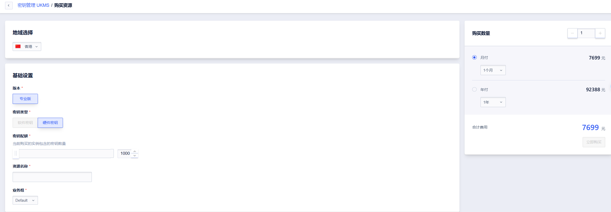

# 快速入门

本文介绍如何快速开始使用 UKMS，包括创建实例、创建密钥和执行第一次加密操作。

## 步骤一：购买 UKMS 实例

在控制台中 [购买UKMS实例](https://console.ucloud.cn/ukms/manage):



通过 API 调用创建实例：

**请求示例**

```json
POST /ukms/create_u_kms_instance

{
  "Action": "CreateUKmsInstance",
  "Region": "cn-bj2",
  "ChargeType": "Month",
  "Quantity": 1,
  "KeyQuota": 100,
  "Name": "my-kms-instance",
  "Type": "software"
}
```

**响应示例**

```json
{
  "Action": "CreateUKmsInstanceResponse",
  "RetCode": 0,
  "Message": "",
  "ResourceId": "ukms-xxxxxxxx"
}
```

记下返回的 `ResourceId`，后续所有操作都需要它。

## 步骤二：创建对称加密密钥

```json
POST /ukms/create_key

{
  "Action": "CreateKey",
  "Region": "cn-bj2",
  "ResourceId": "ukms-xxxxxxxx",
  "KeySpec": "SYMMETRIC_DEFAULT",
  "Description": "我的第一个加密密钥",
  "Origin": "UCLOUD_KMS"
}
```

**响应示例**

```json
{
  "Action": "CreateKeyResponse",
  "RetCode": 0,
  "KeyId": "fd601a9a-c0c9-4dfb-a7ff-e5fd9f484ddc",
  "KeyMetadata": {
    "KeyId": "fd601a9a-c0c9-4dfb-a7ff-e5fd9f484ddc",
    "KeySpec": "SYMMETRIC_DEFAULT",
    "KeyState": "Enabled",
    "KeyUsage": ["ENCRYPT_DECRYPT"],
    "Origin": "UCLOUD_KMS",
    "CreationDate": 1752634800,
    "DeletionProtection": false
  }
}
```

## 步骤三：加密数据

将要加密的数据进行 Base64 编码后，传入 Encrypt 接口：

```json
POST /ukms/encrypt

{
  "Action": "Encrypt",
  "Region": "cn-bj2",
  "ResourceId": "ukms-xxxxxxxx",
  "KeyId": "fd601a9a-c0c9-4dfb-a7ff-e5fd9f484ddc",
  "Plaintext": "SGVsbG8gV29ybGQ="
}
```

> 注意：`Plaintext` 为 Base64 编码的原始数据（上例为 "Hello World" 的 Base64 编码），最大 4KB。

**响应示例**

```json
{
  "RetCode": 0,
  "CiphertextBlob": "AQICAHg5...",
  "KeyId": "fd601a9a-c0c9-4dfb-a7ff-e5fd9f484ddc",
  "EncryptionAlgorithm": "SYMMETRIC_DEFAULT"
}
```

## 步骤四：解密数据

```json
POST /ukms/decrypt

{
  "Action": "Decrypt",
  "Region": "cn-bj2",
  "ResourceId": "ukms-xxxxxxxx",
  "CiphertextBlob": "AQICAHg5..."
}
```

> 注意：对称密钥解密时 KeyId 可以省略，系统会从密文中自动识别。

**响应示例**

```json
{
  "RetCode": 0,
  "Plaintext": "SGVsbG8gV29ybGQ=",
  "KeyId": "fd601a9a-c0c9-4dfb-a7ff-e5fd9f484ddc",
  "EncryptionAlgorithm": "SYMMETRIC_DEFAULT"
}
```

`Plaintext` 为 Base64 编码的解密结果，解码后即为原始数据。

---

## 下一步

- 了解[信封加密](./data-key.md)模式，高效加密大量数据
- 了解如何[管理密钥](./key-management.md)的完整生命周期
- 了解[数字签名](./signing.md)操作
- 查看完整的 [API 参考](../api/overview.md)
