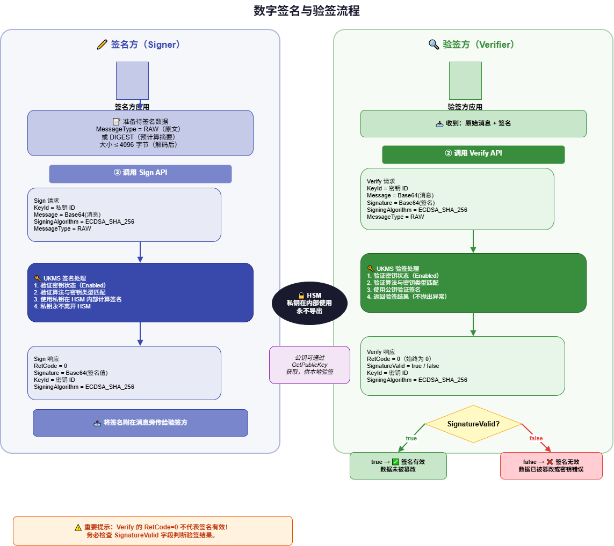

# 数字签名与验签

UKMS 支持使用 RSA 或 ECC 非对称密钥对消息进行数字签名，并验证签名的有效性。

## 概述

数字签名用于验证数据的**完整性**和**来源**：
- 签名方使用私钥对消息签名
- 验签方使用对应的公钥验证签名

在 UKMS 中，私钥始终保存在 HSM 中，签名操作在服务端执行。验签可以使用 UKMS 的 Verify 接口，也可以从 `GetPublicKey` 获取公钥后在本地验签。

## 支持的签名算法

| 算法 | 适用密钥 | 说明 |
|------|----------|------|
| `RSASSA_PSS_SHA_256` | RSA_2048/3072/4096 | RSA-PSS with SHA-256 |
| `RSASSA_PSS_SHA_384` | RSA_3072/4096 | RSA-PSS with SHA-384 |
| `RSASSA_PSS_SHA_512` | RSA_4096 | RSA-PSS with SHA-512 |
| `RSASSA_PKCS1_V1_5_SHA_256` | RSA_2048/3072/4096 | RSA-PKCS1v1.5 with SHA-256 |
| `RSASSA_PKCS1_V1_5_SHA_384` | RSA_3072/4096 | RSA-PKCS1v1.5 with SHA-384 |
| `RSASSA_PKCS1_V1_5_SHA_512` | RSA_4096 | RSA-PKCS1v1.5 with SHA-512 |
| `ECDSA_SHA_256` | ECC_NIST_P256 | ECDSA with SHA-256 |
| `ECDSA_SHA_384` | ECC_NIST_P384 | ECDSA with SHA-384 |
| `ECDSA_SHA_512` | ECC_NIST_P521 | ECDSA with SHA-512 |

## 消息类型（MessageType）

| 类型 | 说明 |
|------|------|
| `RAW`（默认） | 原始消息，UKMS 在签名前自动计算摘要 |
| `DIGEST` | 已预先计算的消息摘要，直接用于签名 |

使用 `DIGEST` 类型时，输入必须是与签名算法哈希函数匹配的摘要（如 SHA-256 的 32 字节摘要）。

## 签名（Sign）

**请求参数**

| 参数 | 类型 | 必填 | 说明 |
|------|------|------|------|
| ResourceId | string | 是 | UKMS 实例 ID |
| KeyId | string | 是 | 非对称密钥 ID 或别名（KeyUsage 须含 SIGN_VERIFY） |
| SigningMessage | string | 是 | 待签名消息，Base64 编码，最大 4096 字节 |
| MessageType | string | 否 | 消息类型：`RAW`（默认）或 `DIGEST` |
| SigningAlgorithm | string | 是 | 签名算法，须与密钥 KeySpec 匹配 |

**请求示例**

```json
POST /ukms/sign

{
  "Action": "Sign",
  "Region": "cn-bj2",
  "ResourceId": "ukms-xxxxxxxx",
  "KeyId": "fd601a9a-c0c9-4dfb-a7ff-e5fd9f484ddc",
  "SigningMessage": "VGhpcyBpcyBhIG1lc3NhZ2U=",
  "MessageType": "RAW",
  "SigningAlgorithm": "RSASSA_PKCS1_V1_5_SHA_256"
}
```

**响应示例**

```json
{
  "RetCode": 0,
  "SignatureResult": "MEYCIQDm...",
  "KeyId": "fd601a9a-c0c9-4dfb-a7ff-e5fd9f484ddc",
  "SigningAlgorithm": "RSASSA_PKCS1_V1_5_SHA_256"
}
```

`SignatureResult` 为 Base64 编码的签名值。

## 验签（Verify）

**请求参数**

| 参数 | 类型 | 必填 | 说明 |
|------|------|------|------|
| ResourceId | string | 是 | UKMS 实例 ID |
| KeyId | string | 是 | 非对称密钥 ID 或别名 |
| SigningMessage | string | 是 | 原始消息，Base64 编码 |
| MessageType | string | 否 | 消息类型：`RAW`（默认）或 `DIGEST` |
| SignatureResult | string | 是 | 待验证的签名，Base64 编码 |
| SigningAlgorithm | string | 是 | 签名时使用的算法 |

**请求示例**

```json
POST /ukms/verify

{
  "Action": "Verify",
  "Region": "cn-bj2",
  "ResourceId": "ukms-xxxxxxxx",
  "KeyId": "fd601a9a-c0c9-4dfb-a7ff-e5fd9f484ddc",
  "SigningMessage": "VGhpcyBpcyBhIG1lc3NhZ2U=",
  "MessageType": "RAW",
  "SignatureResult": "MEYCIQDm...",
  "SigningAlgorithm": "RSASSA_PKCS1_V1_5_SHA_256"
}
```

**响应示例（验签通过）**

```json
{
  "RetCode": 0,
  "KeyId": "fd601a9a-c0c9-4dfb-a7ff-e5fd9f484ddc",
  "SignatureValid": true,
  "SigningAlgorithm": "RSASSA_PKCS1_V1_5_SHA_256"
}
```

**响应示例（验签失败）**

```json
{
  "RetCode": 0,
  "KeyId": "fd601a9a-c0c9-4dfb-a7ff-e5fd9f484ddc",
  "SignatureValid": false,
  "SigningAlgorithm": "RSASSA_PKCS1_V1_5_SHA_256"
}
```

> **注意**：验签失败时 `RetCode` 仍为 0，不以错误码表示。请通过 `SignatureValid` 字段（`true`/`false`）判断验签结果。

## 使用公钥在本地验签

对于高频验签场景，可通过 `GetPublicKey` 获取公钥后在本地验签，无需每次调用 UKMS 服务：

```json
POST /ukms/get_public_key

{
  "Action": "GetPublicKey",
  "Region": "cn-bj2",
  "ResourceId": "ukms-xxxxxxxx",
  "KeyId": "fd601a9a-c0c9-4dfb-a7ff-e5fd9f484ddc"
}
```

返回的 `PublicKey` 为 DER 编码（SPKI 格式）的公钥（Base64 编码），可导入标准密码库用于本地验签。

## 签名流程示意



## 使用限制

| 限制项 | 值 |
|--------|-----|
| 消息最大长度 | 4096 字节 |
| 支持的密钥类型 | RSA_*、ECC_NIST_* |
| 不支持的密钥 | SYMMETRIC_DEFAULT（对称加密用）、HMAC_*（MAC 用） |
| 签名算法必须匹配密钥 | 如 ECC_NIST_P256 只能配合 ECDSA_SHA_256 |

## 常见错误

| 错误 | 含义 | 解决方法 |
|------|------|---------|
| 密钥非非对称密钥 | 使用了对称密钥调用 Sign | 请使用 RSA 或 ECC 类型密钥 |
| 签名算法与密钥不匹配 | 如用 ECDSA_SHA_256 搭配 RSA_2048 | 参考算法-密钥对照表选择正确算法 |
| 消息过长 | SigningMessage 超过 4096 字节 | 使用 `DIGEST` 类型，传入消息摘要 |
