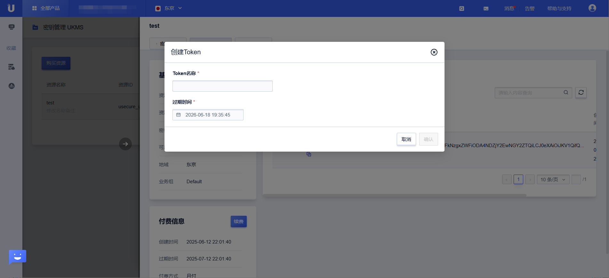
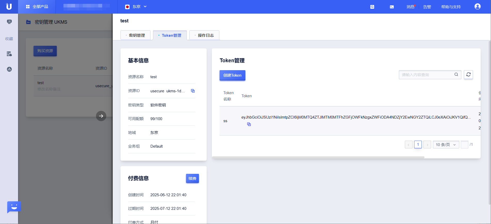

# 访问令牌管理

UKMS 通过 JWT（JSON Web Token）令牌控制对实例资源的访问权限。令牌绑定到特定实例，持有有效令牌的请求方才能对该实例执行操作。

## 令牌管理功能概览

| 功能 | 接口 | 说明 |
|------|------|------|
| 创建/刷新令牌 | RefreshUKmsToken | 创建新令牌或刷新已有令牌 |
| 验证令牌 | ValidateUKmsToken | 验证令牌是否有效 |
| 查询令牌列表 | GetUKmsTokenList | 分页列出实例下的所有令牌 |
| 删除令牌 | DeleteUKmsToken | 删除指定令牌 |
| 查询已删除令牌 | GetUKmsDeleteToken | 查看已删除的令牌列表 |

## 创建/刷新令牌（RefreshUKmsToken）

为指定 UKMS 实例创建 JWT 访问令牌，或刷新已有令牌的有效期。

**请求参数**

| 参数 | 类型 | 必填 | 说明 |
|------|------|------|------|
| ResourceId | string | 是 | UKMS 实例 ID |
| Name | string | 是 | 令牌名称（用于区分不同用途的令牌） |
| ExpiryTime | int64 | 是 | 令牌有效期（Unix 时间戳） |

**请求示例**

```json
POST /ukms/refresh_u_kms_token

{
  "Action": "RefreshUKmsToken",
  "Region": "cn-bj2",
  "ResourceId": "ukms-xxxxxxxx",
  "Name": "backend-service-token",
  "ExpiryTime": 1784256000
}
```

**响应示例**

```json
{
  "RetCode": 0,
  "Token": "eyJhbGciOiJSUzI1NiIs...",
  "ExpiryTime": 1784256000
}
```

> **安全提示**：令牌字符串应安全存储，避免记录到日志中。UKMS 系统在日志中对令牌字段进行了脱敏处理。



## 验证令牌（ValidateUKmsToken）

验证 JWT 令牌的有效性。

```json
POST /ukms/validate_u_kms_token

{
  "Action": "ValidateUKmsToken",
  "Region": "cn-bj2",
  "Token": "eyJhbGciOiJSUzI1NiIs..."
}
```

**响应示例**

```json
{
  "RetCode": 0,
  "Valid": true,
  "ResourceId": "ukms-xxxxxxxx"
}
```

## 查询令牌列表（GetUKmsTokenList）

分页查询实例下的所有令牌，支持按名称过滤。

**请求参数**

| 参数 | 类型 | 必填 | 说明 |
|------|------|------|------|
| ResourceId | string | 是 | UKMS 实例 ID |
| Name | string | 否 | 按令牌名称过滤（模糊匹配） |
| Offset | int | 否 | 起始偏移量，默认 0 |
| Limit | int | 否 | 返回数量 |

**请求示例**

```json
POST /ukms/get_u_kms_token_list

{
  "Action": "GetUKmsTokenList",
  "Region": "cn-bj2",
  "ResourceId": "ukms-xxxxxxxx",
  "Offset": 0,
  "Limit": 20
}
```

**响应示例**

```json
{
  "RetCode": 0,
  "TotalCount": 2,
  "TokenList": [
    {
      "Id": 1,
      "Name": "backend-service-token",
      "Token": "eyJhbGciOiJS****",
      "ExpiryTime": 1784256000,
      "CreateTime": 1752634800
    }
  ]
}
```



## 删除令牌（DeleteUKmsToken）

删除指定令牌，使其立即失效。

```json
POST /ukms/delete_u_kms_token

{
  "Action": "DeleteUKmsToken",
  "Region": "cn-bj2",
  "ResourceId": "ukms-xxxxxxxx",
  "TokenId": 1
}
```

## 查询已删除令牌（GetUKmsDeleteToken）

查看已删除的令牌历史记录，用于审计。

```json
POST /ukms/get_u_kms_delete_token

{
  "Action": "GetUKmsDeleteToken",
  "Region": "cn-bj2",
  "ResourceId": "ukms-xxxxxxxx",
  "Offset": 0,
  "Limit": 20
}
```

## 最佳实践

### 按服务分配令牌
为每个需要访问 UKMS 的服务创建独立的令牌，便于单独撤销某个服务的访问权限：

```
backend-service-token  → 后端主服务
data-pipeline-token    → 数据处理管道
admin-tool-token       → 管理工具
```

### 令牌有效期设置
- 令牌到期后需重新申请
- 建议根据实际安全需求设置合理有效期
- 对于高权限操作，可设置较短有效期（小时级）
- 对于长期运行的服务，可设置较长有效期（月/年级）并建立定期轮换机制

### 令牌泄露处理
如令牌泄露，立即执行以下步骤：
1. 调用 `DeleteUKmsToken` 删除泄露的令牌
2. 调用 `RefreshUKmsToken` 生成新令牌
3. 更新使用该令牌的服务
