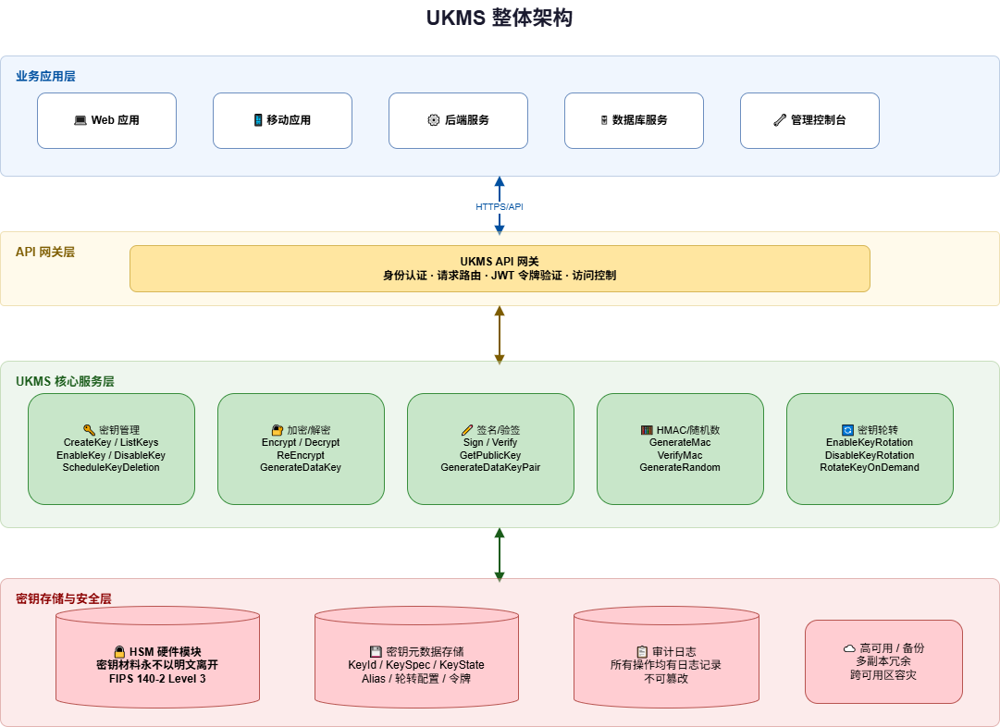

# 产品介绍

## 什么是 UKMS

UCloud 密钥管理服务（UKMS，UCloud Key Management Service）是一项托管式密钥管理服务，让您可以轻松创建和管理加密密钥，控制密钥在各种云服务和应用程序中的使用。

UKMS 使用第三方认证的硬件安全模块 HSM（Hardware Security Module）来生成和保护密钥，满足用户多应用多业务的密钥管理需求，助力用户落实合规要求。

### 核心能力

- **密钥全生命周期管理**：创建、启用、禁用、轮转、删除
- **加密与解密**：对称加密（AES-256-GCM）和非对称加密（RSA）
- **数字签名与验签**：支持 RSA、ECC 多种算法
- **消息完整性校验**：HMAC 消息验证码
- **信封加密**：高效加密海量数据
- **合规认证**：满足 PCI DSS、GDPR、等保 2.0 等标准

---

## 适用场景

### 云上数据加密

使用 UKMS 主密钥（CMK）通过信封加密模式保护存储在 UCloud 对象存储、数据库等服务中的数据。应用程序生成数据密钥用于加密数据，再用 CMK 加密数据密钥，将加密后的数据密钥与密文数据一起存储。

**典型用例**：
- 对象存储中的文件加密
- 数据库敏感字段加密
- 配置文件加密

### 数字签名与身份验证

使用 RSA 或 ECC 非对称密钥对文档、代码、交易记录等进行数字签名，验证数据完整性和来源的可靠性。

**典型用例**：
- 代码签名
- 电子合同签署
- API 请求签名

### 消息完整性验证

使用 HMAC 密钥为消息生成验证码，保证消息在传输过程中未被篡改。

**典型用例**：
- Webhook 签名验证
- API 请求完整性校验
- 数据传输防篡改

### 合规性要求

帮助满足 PCI DSS、GDPR、等保 2.0 等合规标准对密钥管理的要求，通过 HSM 提供符合监管要求的密钥保护。

**典型用例**：
- 金融行业数据加密
- 医疗数据保护
- 政务系统密钥管理

---

## 产品架构

UKMS 由以下组件构成：

| 组件 | 说明 |
|------|------|
| **UKMS API 层** | 提供标准 REST API，处理所有密钥管理和加密操作请求 |
| **密钥管理引擎** | 负责密钥的生命周期管理、轮转调度 |
| **HSM 服务层** | 与硬件安全模块交互，执行实际的密钥操作 |
| **数据存储层** | 持久化存储密钥元数据、实例信息和审计记录 |

---

## 下一步

- 查看 [快速入门](../guides/quickstart.md) 开始使用 UKMS
- 了解 [基本概念](concepts.md) 熟悉密钥管理术语
- 查看 [产品优势](features.md) 了解 UKMS 的核心竞争力
